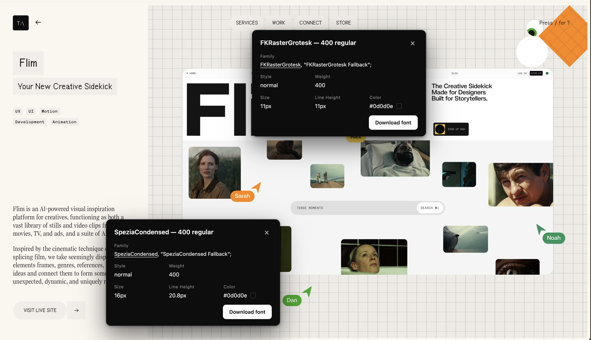
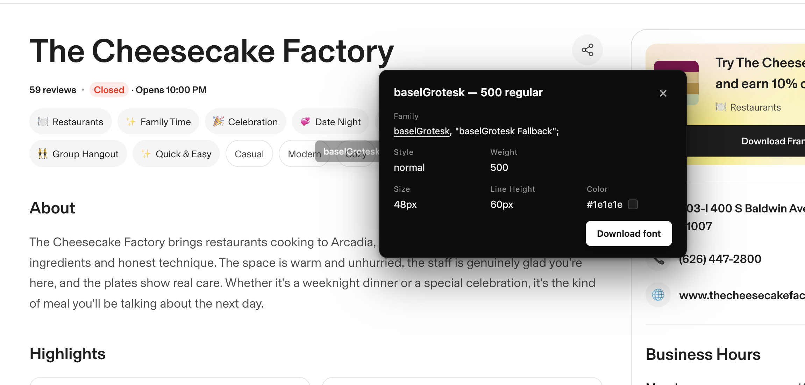
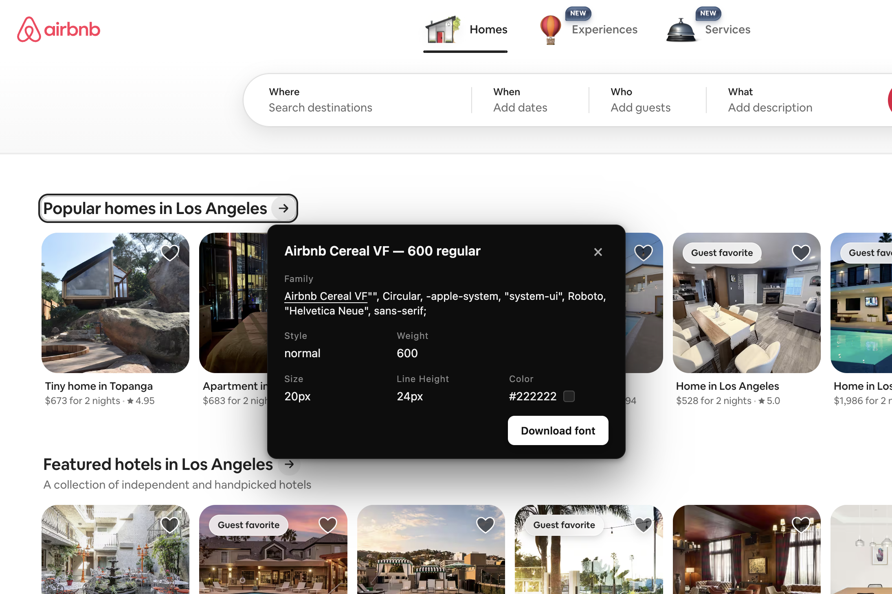

# Fonty

A lightweight, WhatFont-style Chrome extension that identifies and downloads fonts from any webpage.

Hover any text to see the font family. Click to open a detailed inspect card. Download the actual font file the page is serving — straight from `@font-face`.



<sub>Inspecting fonts on [flim.ai](https://flim.ai) — two cards open at once, each anchored near where it was clicked.</sub>

## Features

- **Hover to identify** — a small black tooltip follows the cursor and shows the primary font family for whatever text is under it.
- **Click to inspect** — opens a detailed card with the full font stack, style, weight, size, line-height, and color (with a swatch). Clicks on links and buttons are intercepted, so the page never navigates while inspecting.
- **Stack multiple cards** — click on as many text elements as you want. Each opens its own card, anchored near where you clicked, cascading if they overlap. `Esc` closes them one at a time (most recent first); when the stack is empty, `Esc` exits inspect mode.
- **Download the font file** — Fonty walks the page's `@font-face` rules, picks the best format available (woff2 → woff → ttf → otf), and downloads it via `chrome.downloads`. A toast confirms when the download completes.
- **Subtle, polished motion** — entrance animations on the tooltip and card, swatch pop-in, hover micro-interactions on the close and download buttons, reduced-motion respected.
- **Self-contained UI** — everything renders inside a Shadow DOM so the page's CSS can't affect it (and Fonty's CSS can't affect the page).

## More examples

| | |
| :---: | :---: |
|  |  |
| Family stack, weight, size, line-height, and color — all visible at a glance. | Works on real-world sites with mixed system + custom font stacks. |

## Install (unpacked)

1. Clone or download this repo.
2. Open `chrome://extensions` and toggle **Developer mode** on (top right).
3. Click **Load unpacked** and select the project folder.
4. Pin **Fonty** to your toolbar.

The extension works on any page — click the toolbar icon to start inspecting, click again (or press `Esc` with no cards open) to stop.

## Usage

| Action | What happens |
| --- | --- |
| Click toolbar icon | Toggle inspect mode (cursor becomes a crosshair). |
| Hover text | Tooltip shows the primary font family. |
| Click text | Opens a detail card; clicks on links/buttons are intercepted. |
| Click another text element | Opens an additional card (cards stack). |
| Click a card | Brings it to the front. |
| `×` on a card | Closes that card. |
| `Esc` | Closes the most recently opened card. With no cards open, exits inspect mode. |
| **Download font** button | Downloads the best `@font-face` file for that family/weight; a toast confirms completion. |

## Limitations

- **Cross-origin stylesheets**: browsers block access to `cssRules` for stylesheets loaded without CORS. If the page loads its fonts from such a sheet (some Google Fonts, certain CDNs), Fonty can't see the URL and the download button will be disabled.
- **System fonts**: if the text uses a system-installed font (no `@font-face`), there's no file to download.
- **Restricted pages**: Chrome blocks content scripts on `chrome://`, `chrome-extension://`, the Web Store, and the new tab page. Fonty can't run there.

## Project structure

```
manifest.json    # MV3 manifest
background.js    # service worker: action click + downloads bridge
content.js       # injected on pages: tooltip, cards, font resolver, toasts
content.css      # crosshair cursor while inspect mode is active
icons/           # toolbar icons (16/32/48/128)
screenshots/     # README assets
```

All UI elements live inside a single Shadow DOM root to keep page styles and the extension styles fully isolated.

## Development notes

- **Manifest V3**, service-worker background, no remote code.
- Permissions: `activeTab`, `scripting`, `downloads`, `<all_urls>` host access (needed so the content script can run anywhere and resolve `@font-face` URLs from the same origin).
- No build step. Edit, then hit the reload button on the Fonty card at `chrome://extensions`.

## License

MIT
